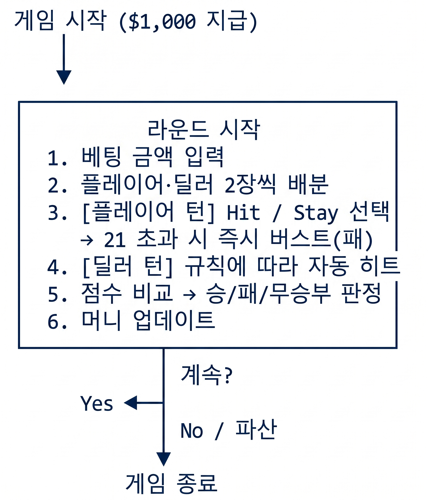
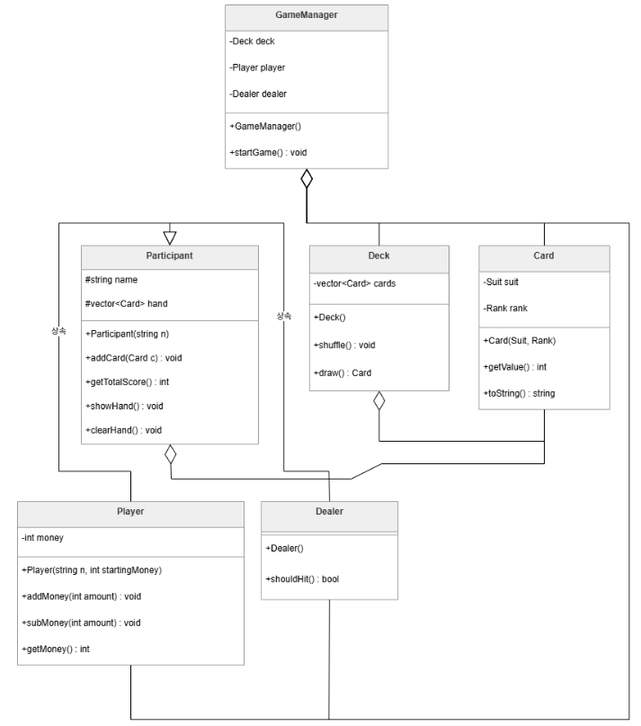
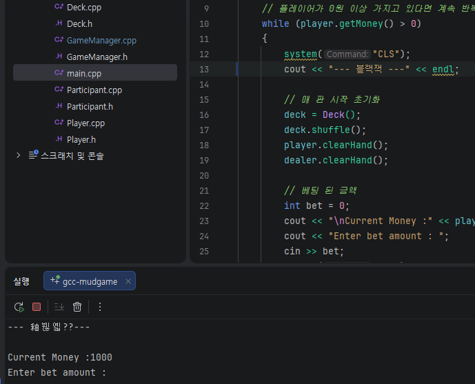
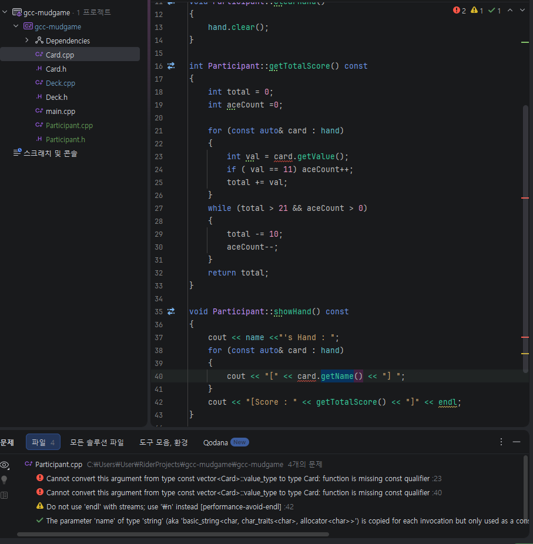

## ♠ BlackjackGame

### 1. 프로젝트 소개

gcc 사관학교 게임과정의 개인 프로젝트로 진행한 `BlackjackGame`은 C++로 구현한 콘솔 기반 블랙잭 카드 게임입니다. 플레이어는 딜러와 대결하여 21에 최대한 가까운 점수를 만들어 승리하는 것을 목표로 합니다. 게임은 표준 52장 덱을 사용하며, 플레이어는 초기 자금 $1,000으로 시작하여 각 라운드마다 베팅을 하게 됩니다. 에이스(Ace)는 11 또는 1로 동적으로 계산되며, 딜러는 16 이하에서는 히트, 17 이상에서는 스탠드하는 규칙을 따릅니다. 게임은 플레이어가 자금을 모두 잃거나 더 이상 플레이를 원하지 않을 때까지 계속됩니다.

<br>

### 2. 팀 구성 및 개발 기간

| 항목 | 내용 |
|------|------|
| 팀 구성 | 이진헌 (개인프로젝트) |
| 개발 기간 | 2026.04.25. |
| 개발 언어 | C++ (Modern C++, STL) |
| 개발 환경 | JetBrains Rider  |
| 빌드 시스템 | Visual C++ (.vcxproj) |

<br>

### 3. 오버뷰 — 핵심 기능 요약

| 기능 | 설명 |
|------|------|
| 카드 생성 및 셔플 | 4가지 수트 × 13가지 랭크 = 52장 덱 자동 생성, `random_shuffle` 기반 셔플 |
| 에이스(Ace) 동적 처리 | 합계가 21을 초과하면 Ace 값을 11 → 1로 자동 변환 |
| 딜러 AI | 합계 16 이하 → 자동 히트, 17 이상 → 스탠드 |
| 베팅 시스템 | 매 라운드 베팅 금액 입력, 보유 금액 초과 시 재입력 요구 |
| 머니 관리 | 승/패/무승부에 따라 플레이어 자금 증감, 파산 시 게임 종료 |
| 화면 갱신 | `system("cls")`를 이용해 매 턴 콘솔 화면 초기화 |
| 라운드 반복 | 플레이어가 계속 플레이할 의사가 있는 한 다음 라운드 자동 진행 |

#### 게임 플로우



<br>

### 4. 시스템 아키텍처 / 클래스 다이어그램

#### 클래스 상속 관계



#### 파일 구조

```
BlackjackGame/
├── BlackjackGame.cpp       ← main() 진입점
├── Card.h / Card.cpp       ← 카드 단위 (수트, 랭크, 값 계산)
├── Participant.h / .cpp    ← 추상 기반 클래스 (핸드 관리, 점수 계산)
├── Player.h / Player.cpp   ← 플레이어 (머니 관리)
├── Dealer.h / Dealer.cpp   ← 딜러 (자동 히트 규칙)
├── Deck.h / Deck.cpp       ← 덱 (52장 생성, 셔플, 드로우)
├── GameManager.h / .cpp    ← 게임 루프 및 전체 진행 제어
└── main.cpp                ← 프로그램 진입점, 게임 시작 및 종료 처리
```

<br>

### 5. 구현 / 미구현 / 부분구현

#### 구현 완료

- 52장 표준 덱 생성 및 셔플
- Ace 값 동적 조정 (11 → 1)
- 플레이어 Hit / Stay 입력
- 딜러 자동 AI (17 규칙 준수)
- 라운드별 베팅 및 승패 머니 정산
- 파산(머니 = 0) 시 게임 자동 종료
- 라운드 반복 플레이

#### 미구현

- **항복(Surrender)** — 규칙 미지원 (항복 후 절반 환급 없음)
- **입력 유효성 검사** — 베팅 금액의 숫자 여부 검사가 없어 문자 입력 시 예상치 못한 동작 가능(프로그램 종료)

#### 부분 구현

- **GUI / 그래픽** — 순수 콘솔 텍스트 출력만 지원

<br>

### 6. 트러블 슈팅

#### 문제 1 - 한글 출력시 콘솔에서 글자가 깨지는 문제



**상황**: 콘솔에서 한글이 깨져서 출력되는 문제 발생.

**원인**: 콘솔의 문자 인코딩이 UTF-8이 아닌 경우, 한글이 제대로 표시되지 않을 수 있다. 특히 Windows 환경에서는 기본적으로 CP949(또는 EUC-KR) 인코딩을 사용하기 때문에 UTF-8로 작성된 문자열이 깨질 수 있다.

**해결**: 콘솔의 문자 인코딩을 UTF-8로 변경하고, C++ 코드에서 출력할 때 UTF-8 인코딩을 사용하도록 설정했는데도 불구하고 문제 지속. **해결 실패**


<br>

#### 문제 2 -



**상황**: const 참조로 객체를 전달받거나, const로 선언된 컨테이너(const vector<Card>) 내의 원소에 접근하여 멤버 함수를 호출할 때 다음과 같은 컴파일 에러가 발생함.

**원인**: C++ 컴파일러는 const 객체가 호출하는 함수가 객체의 내부 상태를 절대로 변경하지 않는다는 것을 보장받아야 한다.

**해결**: 객체의 멤버 변수를 수정하지 않는 모든 함수(주로 Getter 함수나 출력 함수)의 선언과 정의 뒤에 const 키워드를 명시하여 해당 함수가 "상수 함수"임을 컴파일러에게 알린다. 예를 들어, `int getValue() const;`와 같이 선언하면, 이 함수는 객체의 상태를 변경하지 않는다는 것을 보장하게 된다. 이렇게 하면 const 객체에서도 해당 함수를 호출할 수 있게 되어 컴파일 에러가 해결된다.


<br>

### 7. 느낀점

> 이번 프로젝트는 **객체 지향 프로그래밍(OOP)**의 핵심인 상속과 다형성을 실전 코드로 구현하며 추상화의 강력함을 몸소 체험한 소중한 기회였습니다. 특히 Participant라는 추상 기반 클래스를 통해 플레이어와 딜러의 공통 속성을 정의하고 확장하는 과정에서 설계의 효율성을 체감했으며, 에이스 카드의 동적 점수 계산 로직을 구현하며 게임의 규칙을 빈틈없는 코드로 옮기는 정밀함의 중요성을 배웠습니다. 개발 과정에서 마주한 콘솔 인코딩 문제와 const 안정성 오류는 단순히 코드 작성 능력을 넘어 개발 환경 전반에 대한 이해와 문법적 엄격함이 시스템의 안정성에 얼마나 큰 영향을 미치는지 깨닫게 해주었습니다. 그래픽 디자이너로서 시각적 결과물에 집중하던 과거와 달리, 논리적 구조와 예외 처리를 통해 완성도 높은 상호작용 시스템을 구축하는 게임 개발자로서의 시야를 넓힐 수 있었던 유익한 시간이었습니다.